# TASK 1: Working with Git and GitHub

---

In this task, I learned the basics of **Git and GitHub** and how they are used for version control, managing different versions of a project, and collaborating with other developers.

I started by creating a simple Python calculator and used Git to track the changes made to it. I created branches for adding new operations, merged the changes into the main branch, and explored different ways of managing commits using `git revert` and `git cherry-pick`.

## Git Basics

I practiced the basic Git workflow by creating a local repository and tracking changes made to the calculator program.

Some of the commands I used were:

| Command | Purpose |
|---|---|
| `git init` | Creates a new Git repository |
| `git status` | Shows the current status of the repository |
| `git add` | Moves changes to the staging area |
| `git commit` | Records changes in Git history |
| `git log` | Displays the commit history |
| `git branch` | Creates or lists branches |
| `git checkout` | Switches between branches |
| `git merge` | Combines changes from one branch into another |
| `git remote` | Manages connections to remote repositories |
| `git push` | Uploads local commits to GitHub |
| `git clone` | Downloads a repository from GitHub |

I created separate branches for the calculator features and worked on them independently before merging them into the `master` branch.

## Git Revert

I used `git revert` to undo the **power operation** that had been added to the calculator.

Instead of deleting the original commit, Git created a new commit that reversed the changes made by that commit. This helped me understand how Git maintains the complete history of a project even when changes need to be undone.

## Git Cherry-Pick

After reverting the power operation, I used `git cherry-pick` to apply the original power-operation commit back to the current branch.

```bash
git cherry-pick <commit id>
```

## Open-Source Contribution

As part of this task, I also learned how to contribute to an open-source project using GitHub.

I forked the **TheAlgorithms/Python** repository to my GitHub account and cloned the fork to my local system. I then created a separate branch called `add-simple-algorithm` so that my changes could be developed independently from the main branch.

I added a new **Harmonic Mean** algorithm in the existing `maths` directory.

## IMAGES
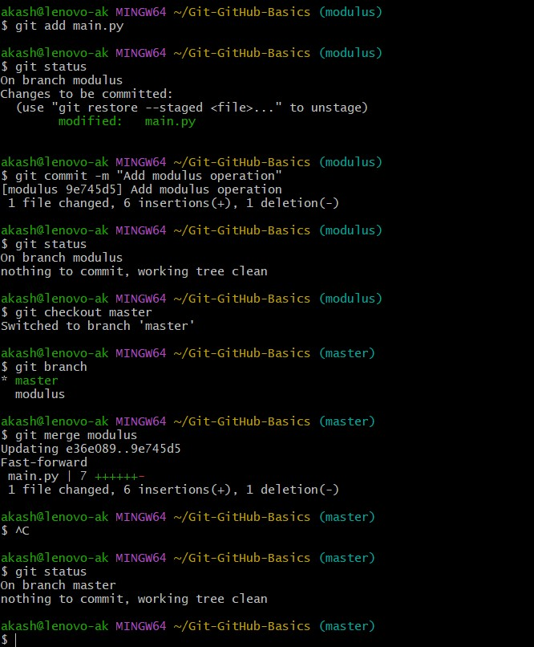

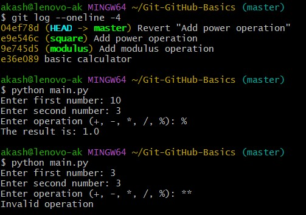

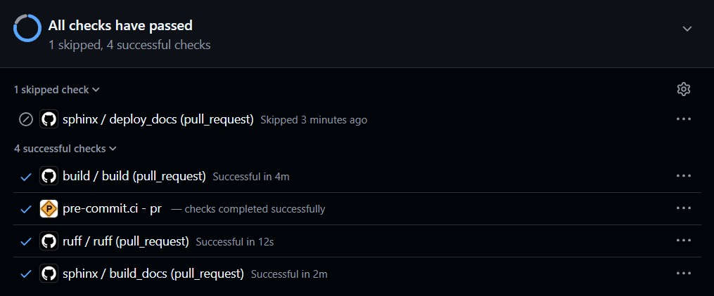
---

# TASK 2: Exploring Docker Fundamentals

---

In this task I learned the fundamentals of **Docker** and how containers are used to run applications in an isolated and lightweight environment. I started by understanding the difference between **containers and virtual machines**, and then practiced basic Docker commands using the Docker CLI.

A **Docker image** acts as a template containing the files, dependencies and configuration required to run an application, while a **container** is a running instance of that image. I also explored **Docker Hub**, which is a public registry where Docker images can be stored and shared.

## Understanding Containers and Virtual Machines

A **virtual machine** runs a complete guest operating system on top of a hypervisor. Since each virtual machine includes its own operating system, it generally requires more storage and system resources.

A **container**, on the other hand, shares the host operating system kernel while isolating the application and its dependencies. This makes containers lightweight, faster to start and convenient for deploying applications.

| Feature | Containers | Virtual Machines |
|---|---|---|
| Virtualization | Operating-system level | Hardware level |
| Operating System | Shares the host kernel | Has its own guest OS |
| Startup | Usually very fast | Usually slower |
| Resource Usage | Lower | Higher |
| Size | Generally smaller | Generally larger |
| Isolation | Application/process level | Machine level |

This comparison helped me understand why Docker containers are widely used for application development, testing and deployment.

## Docker Containers and Commands

I used Docker CLI commands to pull the **Ubuntu** image from Docker Hub and run it as a container. I also worked with an **Nginx** container by mapping its port and accessing the Nginx welcome page through the browser.

I practiced commands to view running containers, check container logs, inspect container details and view running processes. Finally, I managed the container lifecycle by starting, stopping, restarting and removing containers.

This task gave me a practical understanding of how Docker images and containers work and how containers can be managed using the command line.

| Command | Purpose |
|---|---|
| `docker --version` | Checks the installed Docker version |
| `docker pull <image>` | Downloads an image from Docker Hub |
| `docker images` | Lists downloaded Docker images |
| `docker run <image>` | Creates and runs a container |
| `docker ps` | Shows running containers |
| `docker ps -a` | Shows all containers |
| `docker start <container>` | Starts a stopped container |
| `docker stop <container>` | Stops a running container |
| `docker restart <container>` | Restarts a container |
| `docker logs <container>` | Displays container logs |
| `docker inspect <container>` | Shows detailed container information |
| `docker top <container>` | Shows processes running in a container |
| `docker exec -it <container> <command>` | Executes a command inside a running container |
| `docker rm <container>` | Removes a container |
| `docker rmi <image>` | Removes a Docker image |

## Images
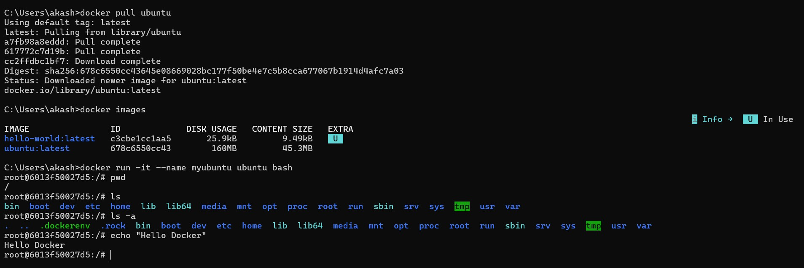

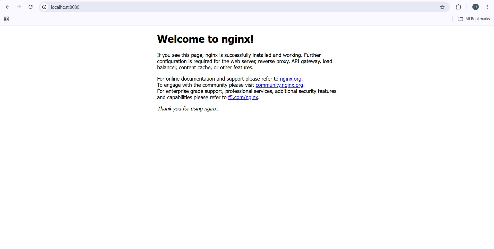
- - -

# TASK 3: Dockerize a Simple Application
---

In this task I learned how to containerize a simple static website using Docker. I created a multi-page website using **HTML, CSS and JavaScript** and used **Nginx** to serve the website inside a Docker container.

I created a `Dockerfile` using instructions such as `FROM`, `LABEL`, `WORKDIR`, `COPY`, `EXPOSE` and `CMD`. I also created a `.dockerignore` file to avoid including unnecessary files in the Docker build context.

After creating the files, I built a Docker image and ran it as a container with port mapping. I accessed the website through the browser and tested its different pages and JavaScript functionality.

I also practiced useful Docker commands such as `docker logs`, `docker inspect` and `docker exec` to check and explore the running container. Finally, I stopped, started, restarted and removed the container to understand the basic Docker container lifecycle.

I created a `Dockerfile` to define how the website should be built and run inside the Docker container. The main instructions used in the Dockerfile were:

| Dockerfile Instruction | Purpose |
|---|---|
| `FROM nginx:latest` | Uses the latest Nginx image as the base image. |
| `LABEL maintainer="Akash"` | Adds information about the maintainer of the image. |
| `LABEL description="Docker Task 3 - Static Website"` | Describes the purpose of the Docker image. |
| `WORKDIR /usr/share/nginx/html` | Sets the working directory where the website files are stored. |
| `COPY website/ .` | Copies the website files from the local `website` folder into the Nginx web directory. |
| `EXPOSE 80` | Indicates that the container uses port 80 for the web server. |
| `CMD ["nginx", "-g", "daemon off;"]` | Starts Nginx in the foreground when the container runs. |

This task helped me understand how a Dockerfile is used to create an image and how an application can be packaged and run consistently inside a container.


## Images
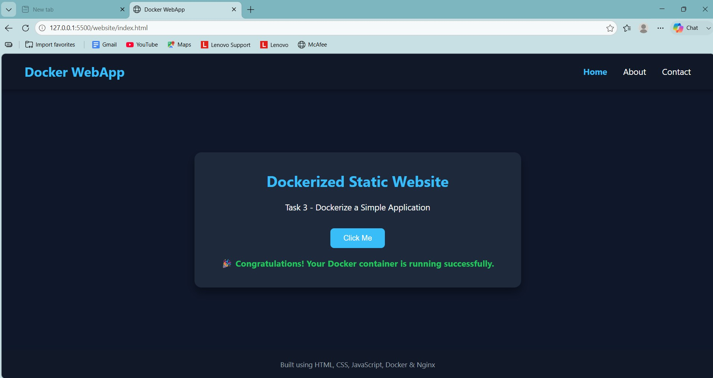

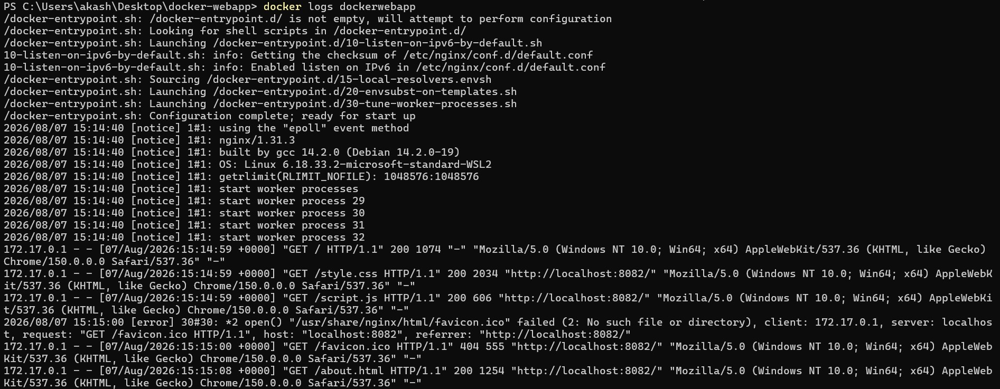
- - -

# TASK 4: Launch and Manage an AWS EC2 Instance
---

In this task I explored **AWS EC2** and learned how to launch and manage a virtual machine in the cloud. I created a **t3.micro EC2 instance** using Amazon Linux 2023 and configured the security group to allow SSH and HTTP traffic.

I created and used a **.pem key pair** to securely connect to the instance through SSH. After connecting, I installed and configured **Nginx** as a lightweight web server and confirmed that it was running and accessible through the instance's public IP address.

I also checked the CPU and memory resources available to the virtual machine using `lscpu` and `free -h`. The instance provided **2 vCPUs** and around **913 MiB of memory**. I also understood that the `t3.micro` is a burstable instance type that uses **CPU credits** when additional CPU performance is required.

Overall, this task gave me practical experience with launching an EC2 instance, securely accessing it, configuring network access, hosting a web server, and understanding the basic CPU and memory resources of a cloud VM.

## Images
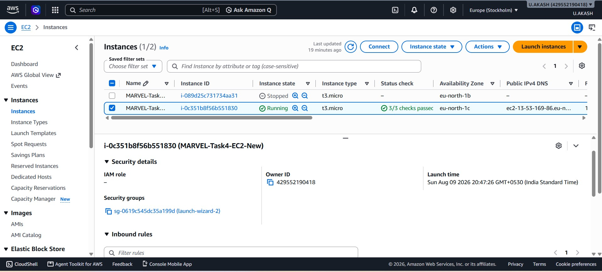

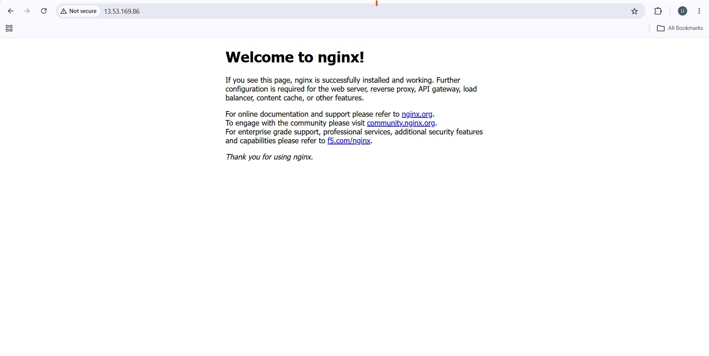
- - -
# TASK 5: Kubernetes Basics and Writing Pod Specs

---

In this task, I learned the basics of **Kubernetes** and how it is used to manage containerized applications. I understood the role of a **Kubernetes cluster, nodes, Pods, and the control plane**, and learned how Kubernetes uses YAML manifest files to define and deploy workloads.

I created a local Kubernetes cluster using **Minikube** with Docker as the driver and used `kubectl` to interact with the cluster. I then created a Pod specification for an **Nginx** container using a YAML manifest.

The Pod manifest defined the Pod name, labels, container name, Nginx image, and container port.

### Pod YAML File

I created a `pod.yaml` file to define the configuration of the Nginx Pod. The main fields used in the file are:

| YAML Field | Purpose |
|---|---|
| `apiVersion: v1` | Specifies the Kubernetes API version used for the Pod. |
| `kind: Pod` | Defines the Kubernetes resource as a Pod. |
| `metadata` | Contains the Pod's name and labels. |
| `name: nginx-pod` | Gives the Pod a unique name. |
| `labels` | Adds identifying information to the Pod. |
| `spec` | Defines the desired configuration of the Pod. |
| `containers` | Specifies the containers that run inside the Pod. |
| `name: nginx` | Gives the container its name. |
| `image: nginx:latest` | Specifies the Nginx container image to use. |
| `containerPort: 80` | Specifies the port on which the Nginx container listens. |

## Images
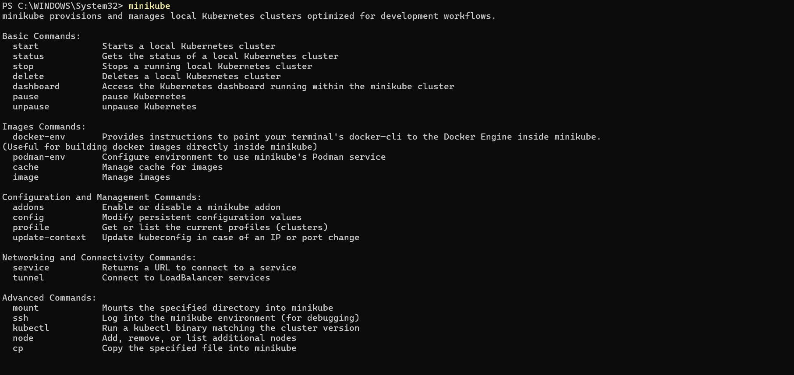

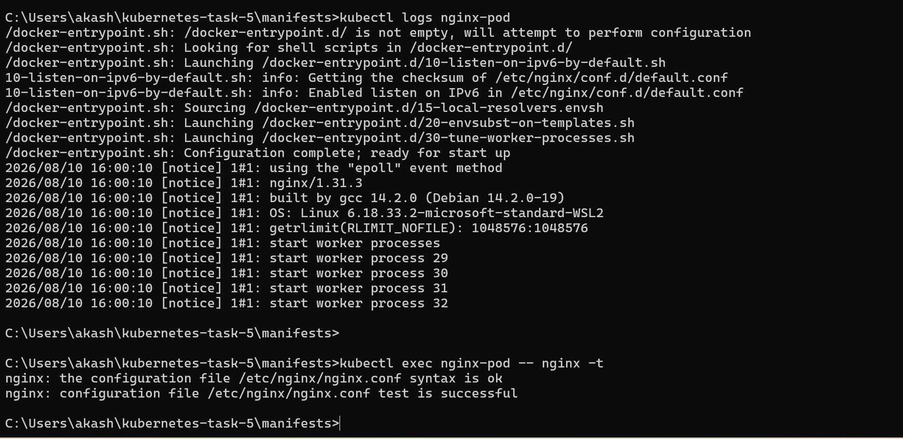
- - -
# TASK 6: Manage AWS S3 and IAM with CLI

---

In this task, I worked with **AWS S3 and IAM using the AWS CLI**. The main objective was to create an IAM user, configure the required permissions, and use the AWS CLI to manage an S3 bucket.

I first created an IAM user named **AKASH_CLI** with console and programmatic access. Instead of using an existing policy, I created custom IAM policies for the task. The **S3BucketCreationPolicy** was created to provide the required permissions for S3 bucket operations, while the **S3BucketObjectAccessPolicy** was created to allow listing, uploading, downloading and deleting objects from the specific S3 bucket. Both policies were then attached directly to the `AKASH_CLI` user.

After configuring IAM, I created an S3 bucket named **`akash-s3-cli-94800`** in the **ap-south-1 (Mumbai)** region using the AWS CLI. I created a local `upload` and `download` folder and added a sample `test.txt` file to the upload folder.

I then performed the following S3 operations using the CLI:

- Uploaded `test.txt` to the S3 bucket.
- Listed the bucket contents to confirm the uploaded file.
- Downloaded the file back to the local `download` folder.
- Checked the downloaded file and its contents.
- Deleted the file from the S3 bucket.
- Listed the bucket again to confirm it was empty.
- Used `aws sts get-caller-identity` to confirm that the CLI was using the `AKASH_CLI` IAM user.

### S3 Details

| Item | Details |
|---|---|
| Bucket | `akash-s3-cli-94800` |
| Region | `ap-south-1 (Mumbai)` |
| IAM User | `AKASH_CLI` |
| Test File | `test.txt` |
| Operations | Upload, List, Download, Delete |

Through this task, I understood how **custom IAM policies can be created and attached to users** and how permissions control access to AWS resources. I also practiced managing an S3 bucket and its objects directly through the **AWS CLI**.

## Images
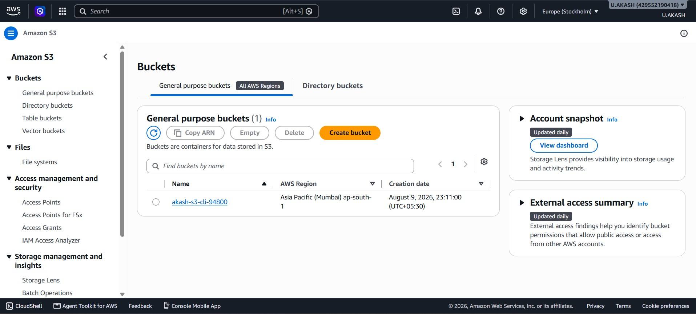

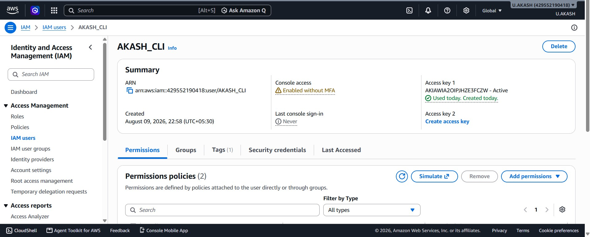

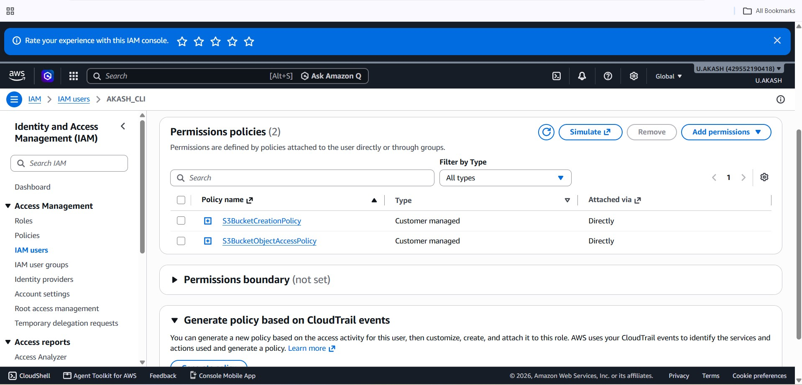

- - - 
# TASK 7: Deploy a Containerized Application on Kubernetes
---

In this task I deployed a **Dockerized Flask application on Kubernetes** using **Minikube**. I created Kubernetes YAML manifests for a Deployment and Services and used them to manage and expose the application.

I first created the Flask application and packaged it into a Docker image named `kubernetes-task-7-app:1.0`. After testing the application locally I loaded the image into Minikube and created a Kubernetes Deployment with **3 replicas**.

I then created a **ClusterIP Service** to expose the application within the Kubernetes cluster. I also created a **NodePort Service** using port `30080` to access the application externally. The application was successfully opened in the browser through the Minikube service URL.

To practice Kubernetes scaling I scaled the Deployment from **3 replicas to 5 replicas** and verified that all five Pods were running. I then scaled it back down to **2 replicas**.

Finally I created a new Docker image version `kubernetes-task-7-app:1.1` loaded it into Minikube and updated the Deployment using `kubectl set image`. I verified that the rolling update completed successfully and that the new Pods were running the updated image.

The Kubernetes setup was managed using the following YAML files:

- `deployment.yaml` – Defines the application Deployment and replicas.
- `service-clusterip.yaml` – Exposes the application internally using ClusterIP.
- `service-nodeport.yaml` – Exposes the application externally using NodePort.

Through this task I worked with Kubernetes **Deployments, Pods, Services, scaling, NodePort access, and rolling updates**. I also understood how Kubernetes maintains the required number of application replicas and updates them without manually recreating the containers.

## Images
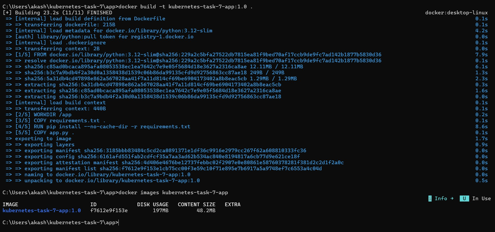

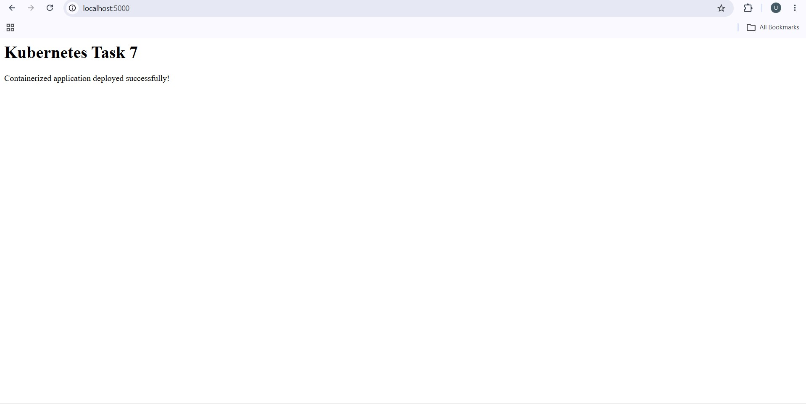

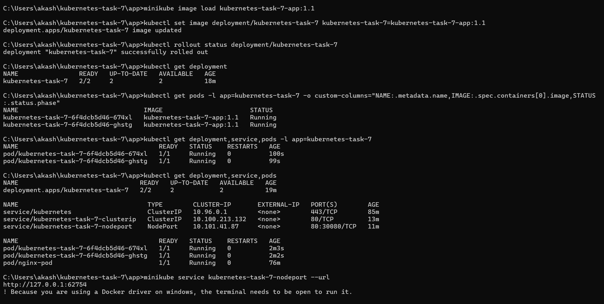
- - -
# **Task 8: Use Kubernetes Secrets and Environment Variables**
- - -

In this task, I learned how to use **Kubernetes ConfigMaps and Secrets** to manage application configuration and sensitive information separately from the application code.

I created a Flask application using **Python, Flask and Boto3** and packaged it into a Docker image named `kubernetes-task-8-app:1.0`. I then loaded the image into **Minikube** and deployed the application using a Kubernetes Deployment with **2 replicas**.

I created a **ConfigMap** to store non-sensitive configuration such as the application message and AWS region. These values were injected into the Pods as environment variables and verified from inside the running containers.

I also created a **Kubernetes Secret** named `kubernetes-task-8-aws-secret` to store the AWS credentials. The credentials were injected into the Deployment as environment variables instead of being hardcoded in the application.

The application was connected to the AWS S3 bucket `akash-s3-cli-94800` using **Boto3**. I created a NodePort Service to access the application through the browser and tested the following endpoints:

| Endpoint | Result |
|---|---|
| `/` | ConfigMap values displayed successfully |
| `/health` | Application returned `healthy` |
| `/s3` | S3 bucket access verified with HTTP 200 |

I also verified that the Deployment had **2/2 available replicas**, both Pods were running, and the application logs showed successful requests.

Through this task, I learned the difference between **ConfigMaps and Secrets**. ConfigMaps are used for non-sensitive configuration, while Secrets are used to store sensitive information such as AWS credentials. I also learned how Kubernetes can provide these values to applications through environment variables.

## Images

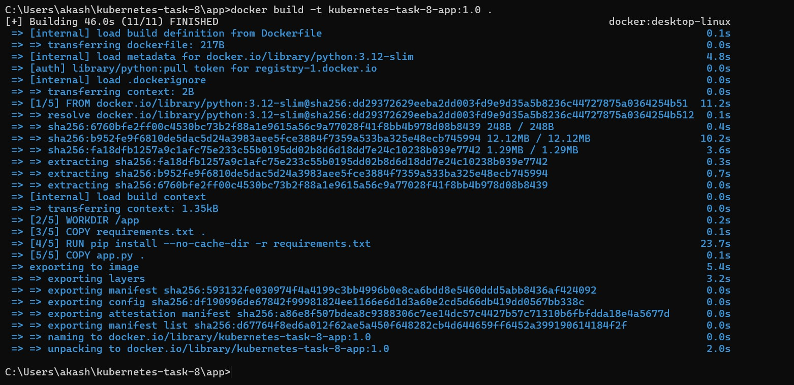

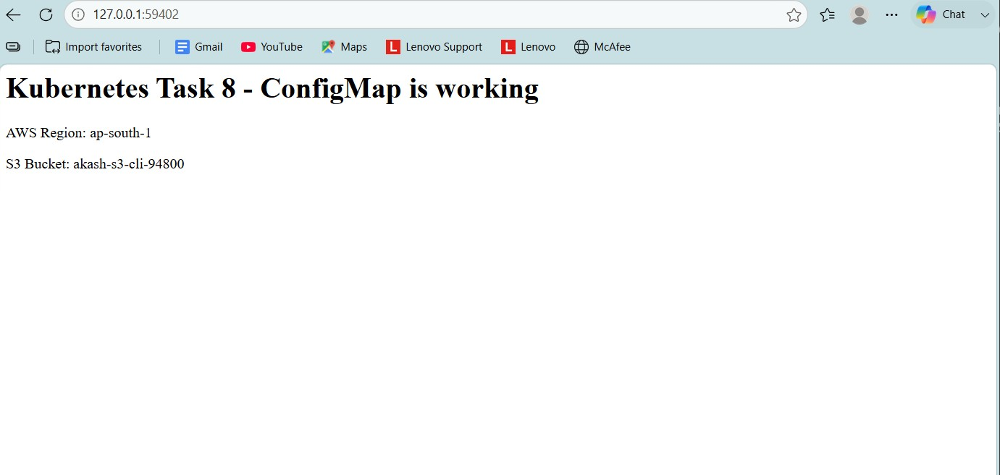


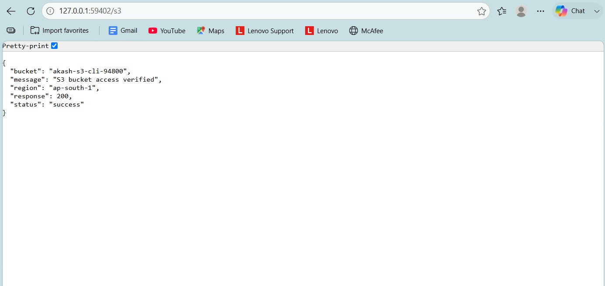
- - -
- - -
# TASK: TryHackMe UVCE MARVEL Level 1 (CL-CY) – Cybersecurity
---

As part of the MARVEL Level 1 activities, I completed all **26 tasks** in the UVCE MARVEL Level 1 TryHackMe room. The room provided a practical introduction to computer networking, operating systems, cryptography, and cybersecurity.


- **Networking:** IP addresses, ports, packets, frames, networking devices, DNS, DHCP, ICMP, HTTP/HTTPS, and network models.
- **Windows:** Windows basics, PowerShell, CMD, System32, user accounts, UAC, and Windows security.
- **Linux:** Linux basics, terminal usage, file systems, and important directories.
- **Cryptography:** Encryption, decryption, plaintext, ciphertext, symmetric and asymmetric cryptography, and cipher analysis.
- **Cybersecurity:** CIA Triad — Confidentiality, Integrity, and Availability.
- **Red Teaming:** Attack surfaces, security testing, vulnerability identification, authorized testing, and reporting.

I successfully completed all **26 tasks**. The TryHackMe exercises helped me connect theoretical concepts with practical scenarios.
## Images and attachments
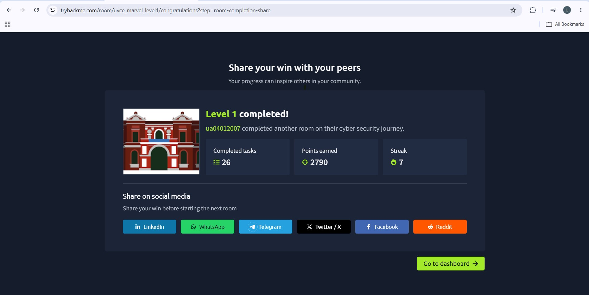

[View PDF](cy_DNS.pdf)

[click here for detailed report](CY.md)
---
